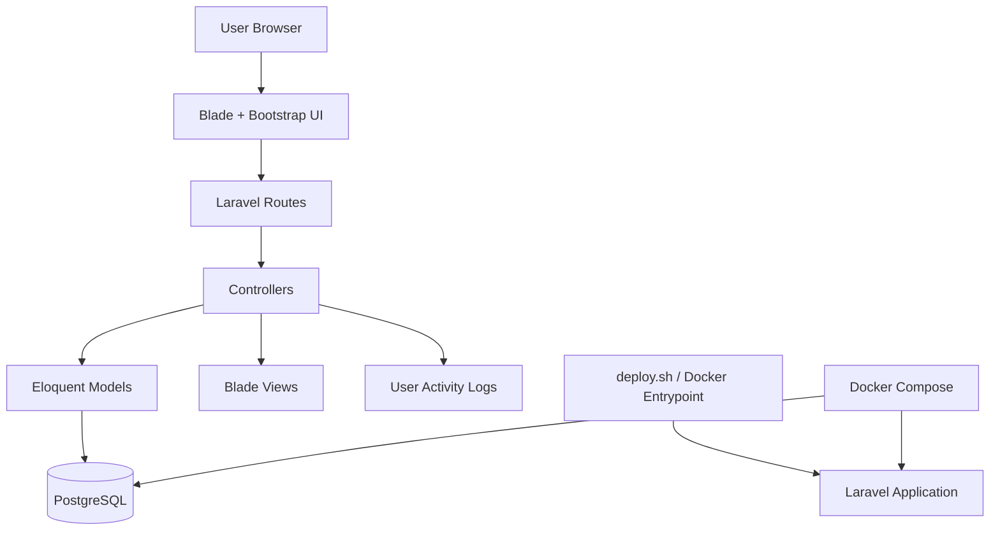
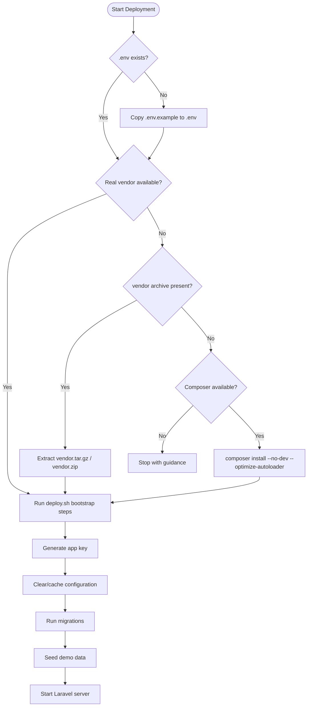

# Audit Management System (Laravel 10 + PostgreSQL)

Offline-ready Audit Management System with RBAC (`Admin`, `Auditor`, `Reviewer`) and modules for:

- User Management
- Audit Planning
- Audit Fieldwork
- Audit Findings
- Follow-up Tracking
- Dashboard analytics
- RBAC Dynamic Menu Builder (drag & drop ordering, Vue.js UI)

## Project structure delivered
- Laravel-style app bootstrapping (`artisan`, `bootstrap/app.php`, `public/index.php`)
- Models, controllers, middleware, routes
- Blade views with Bootstrap-styled UI
- PostgreSQL migrations with FKs and indexes
- Seeders + demo data
- Offline deployment script (`deploy.sh`)
- Offline installation guide (`OFFLINE_INSTALLATION.md`)

## Quick start
1. Copy `.env.example` to `.env` and configure PostgreSQL.
2. Ensure `vendor/` (Composer dependencies) exists.
3. Run:
   ```bash
   ./deploy.sh
   ```

## Demo users
- `admin@audit.local` / `password123`
- `auditor@audit.local` / `password123`
- `reviewer@audit.local` / `password123`


## System structure diagram


## Deployment process diagram


## Troubleshooting
- Error about incomplete Composer dependencies means the full `vendor/` package was not included (both `vendor/autoload.php` and `vendor/composer/autoload_real.php` are required).
- Build dependencies on a connected Linux machine with:
  ```bash
  composer install --no-dev --optimize-autoloader
  ```
- Required Composer files include `vendor/autoload.php` and core files under `vendor/composer/` (e.g., `autoload_real.php`, `autoload_psr4.php`, `autoload_static.php`, `ClassLoader.php`, `installed.json`, `installed.php`).
- If a packaged dependency archive such as `vendor.tar.gz`, `vendor.tgz`, or `vendor.zip` is present, `./deploy.sh` will extract it automatically before bootstrapping.
- If placeholder vendor files are present and `composer` is available on the target server, `./deploy.sh` will otherwise try `composer install --no-dev --optimize-autoloader`.
- If that automatic rebuild fails, replace the placeholder files with the complete generated `vendor/` directory or include a packaged vendor archive.
- Copy the resulting `vendor/` folder or packaged vendor archive into this project before running `./deploy.sh`.


## RBAC dynamic menu
- Admin users can manage menu visibility by role and order from **Admin > Menu Builder**.
- Menu Builder UI is implemented with Vue.js for inline create/update/delete and drag-drop reordering without page refresh.
- Drag and drop menu rows to change order; updates are saved instantly.
- Menu entries support Laravel route names or custom URLs, with per-role visibility rules.

## Docker run
1. Package real Composer dependencies into `vendor/` or provide `vendor.tar.gz` in the project root.
2. Build and start the containers:
   ```bash
   docker compose up --build
   ```
3. Open the application at `http://localhost:8000`.

The `app` container runs `deploy.sh` on startup, and will automatically extract `vendor.tar.gz` if present before bootstrapping.
